# Banking & Finance DevOps Capstone Project

**Author:** Rajnish Kumar  
**Domain:** Banking and Finance  
**Project Overview:** A comprehensive CI/CD pipeline implementation with infrastructure automation, containerization, and monitoring stack on AWS.

---

## Table of Contents

1. [Project Architecture](#project-architecture)
2. [Prerequisites](#prerequisites)
3. [Step-by-Step Implementation](#step-by-step-implementation)
4. [Troubleshooting](#troubleshooting)
5. [Repository Structure](#repository-structure)

---

## Project Architecture

This project demonstrates a complete DevOps workflow:

- **Infrastructure as Code (IaC):** Terraform for provisioning AWS EC2 instances
- **CI/CD Pipeline:** Jenkins for automated build and deployment
- **Containerization:** Docker for application containerization
- **Configuration Management:** Ansible for infrastructure orchestration
- **Monitoring & Observability:** Prometheus and Grafana for metrics collection and visualization


---

## Prerequisites

Before starting, ensure you have:

- AWS Account with appropriate IAM permissions
- Terraform installed on your local machine
- SSH key pair for EC2 access
- Docker Hub account
- Basic understanding of CI/CD, Linux, and AWS services

---

## Step-by-Step Implementation

### Step 1: Login to AWS & Launch Terraform Instance

Access the AWS Management Console and launch a new EC2 instance running Ubuntu. This instance will serve as your Terraform server for infrastructure provisioning.

**Image Reference:**
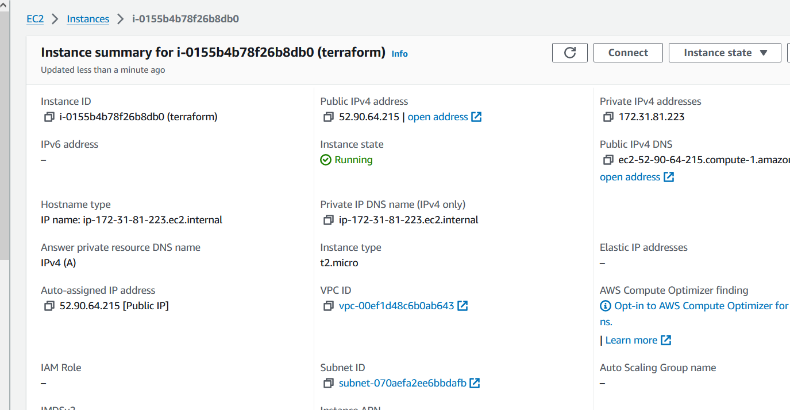

---

### Step 2: Create Terraform Setup Directory and main.tf

Create a dedicated directory for Terraform configuration on your instance:

```bash
mkdir terraform-setup
cd terraform-setup
vi main.tf
```

**Sample main.tf Configuration:**

```hcl
# Define the EC2 instances
resource "aws_instance" "my_instance" {
  count           = 3  # Launch three instances
  ami             = "ami-04a81a99f5ec58529"
  instance_type   = "t2.medium"
  key_name        = "rjkey"
  
  tags = {
    Name = "my-instance-${count.index + 1}"
  }
}

# Output the instance IDs and public IPs
output "instance_ids" {
  value = aws_instance.my_instance[*].id
}

output "instance_public_ips" {
  value = aws_instance.my_instance[*].public_ip
}
```

**Initialize and Validate Terraform:**

```bash
terraform init
terraform plan
```

**Image Reference:**
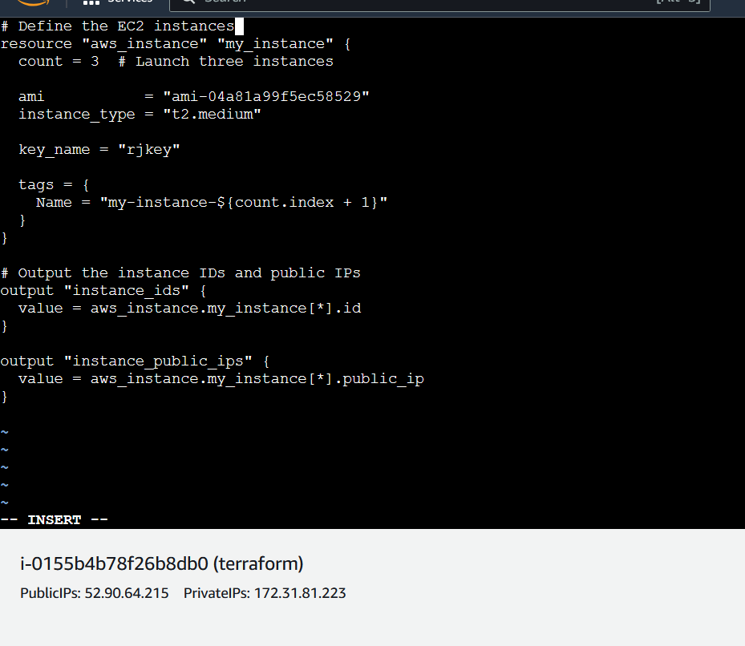
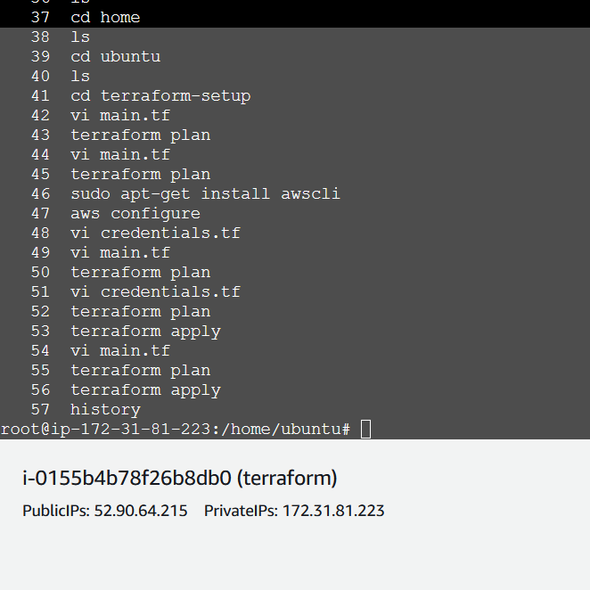
---

### Step 3: Execute Terraform Apply

Apply the Terraform configuration to provision your AWS infrastructure:

```bash
terraform apply
```

The command will create three EC2 instances:
- **Master** (i-0e2dbba8220d): Jenkins server
- **Monitoring** (i-0971e86737a0): Prometheus & Grafana server
- **Host** (i-03700b7e5787): Application deployment host

**Console Output:**

```
Apply complete! Resources: 3 added, 0 changed, 0 destroyed.

Outputs:
instance_ids = [
  "i-0e2dbba8220d82d4a",
  "i-0971e86737a0fe0a8",
  "i-03700b7e578711540",
]

instance_public_ips = [
  "35.175.219.113",
  "3.90.33.244",
  "54.160.143.217",
]
```

**Image Reference:**
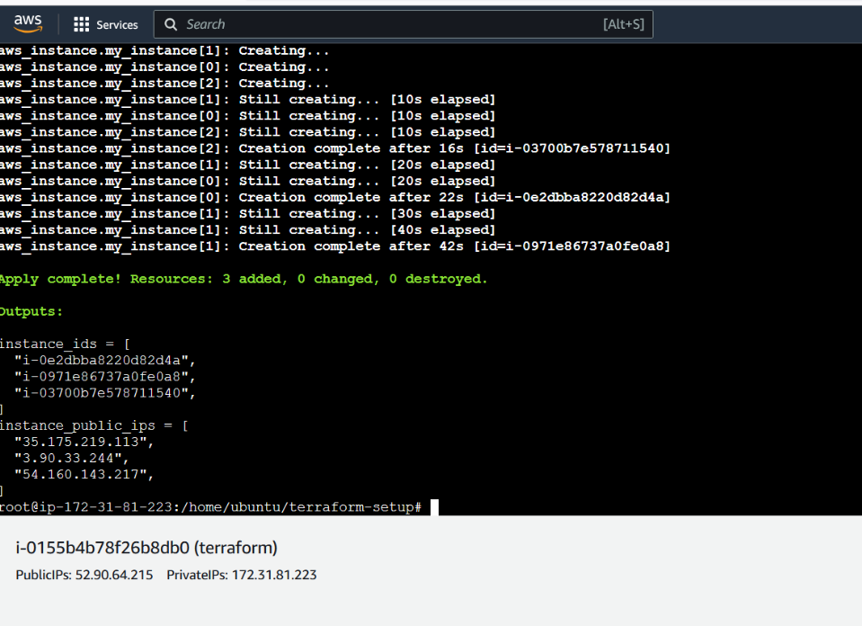
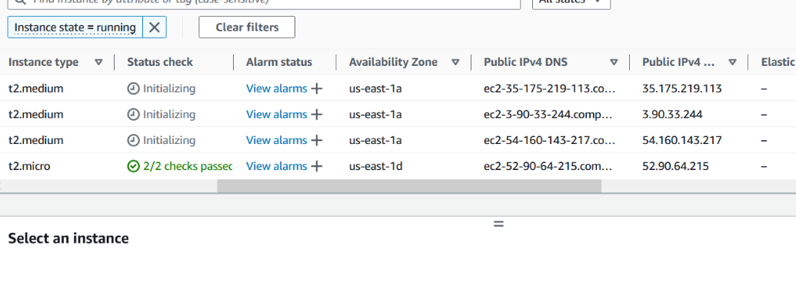

---

### Step 4: Connect to Master Instance

SSH into the master instance using the public IP:

```bash
ssh -i rjkey.pem ubuntu@35.175.219.113
```

Once connected, switch to root user:

```bash
sudo su
```

**Image Reference:**


---

### Step 5: Install Docker

Update package manager and install Docker:

```bash
sudo apt update
sudo apt install docker.io -y
sudo systemctl enable docker
sudo systemctl start docker
docker --version
```

Verify Docker installation:

```bash
docker ps
```

**Image Reference:**
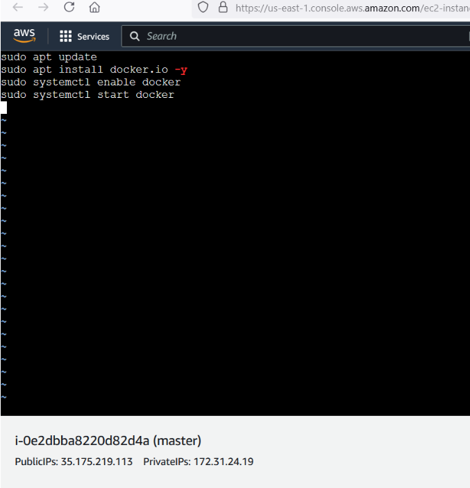

---

### Step 6: Install Jenkins

Add Jenkins repository and install:

```bash
sudo wget -O /usr/share/keyrings/jenkins-keyring.asc \
  https://pkg.jenkins.io/debian/jenkins.io-2023.key

echo "deb [signed-by=/usr/share/keyrings/jenkins-keyring.asc]" \
  https://pkg.jenkins.io/debian binary/ | sudo tee \
  /etc/apt/sources.list.d/jenkins.list > /dev/null

sudo apt-get update
sudo apt-get install jenkins -y
sudo systemctl enable jenkins
sudo systemctl start jenkins
```

Add Jenkins to Docker group for container management:

```bash
sudo usermod -aG docker jenkins
sudo systemctl restart jenkins
```

**Image Reference:**
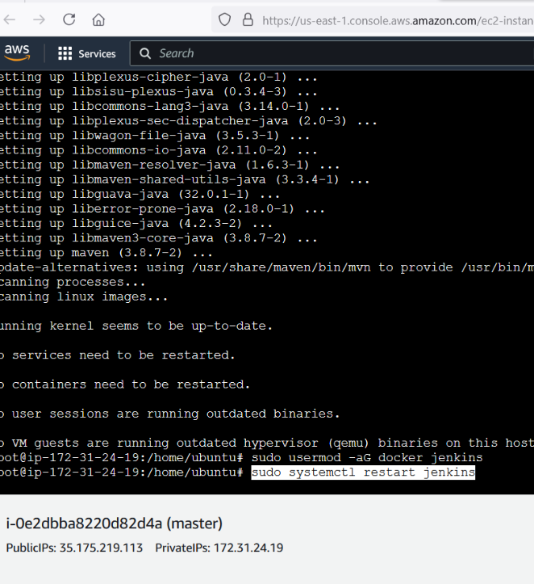

---

### Step 7: Verify Jenkins Status

Check if Jenkins service is running:

```bash
sudo systemctl status jenkins
```

**Expected Output:**
```
● jenkins.service - Jenkins Continuous Integration Server
  Loaded: loaded (/usr/lib/systemd/system/jenkins.service; enabled; preset: enabled)
  Active: active (running) since Tue 2024-08-13 17:28:56 UTC; 39s ago
  Main PID: 9036 (java)
```

**Image Reference:**
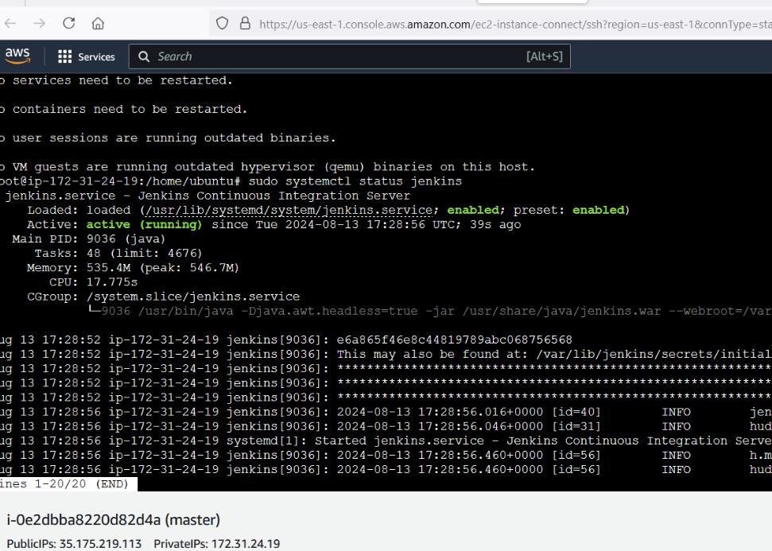

---

### Step 8: Access Jenkins Web Interface

Open your browser and navigate to:

```
http://35.175.219.113:8080
```

Retrieve the initial admin password:

```bash
sudo cat /var/lib/jenkins/secrets/initialAdminPassword
```

Log in with the admin password and complete the initial setup wizard.

**Image Reference:**
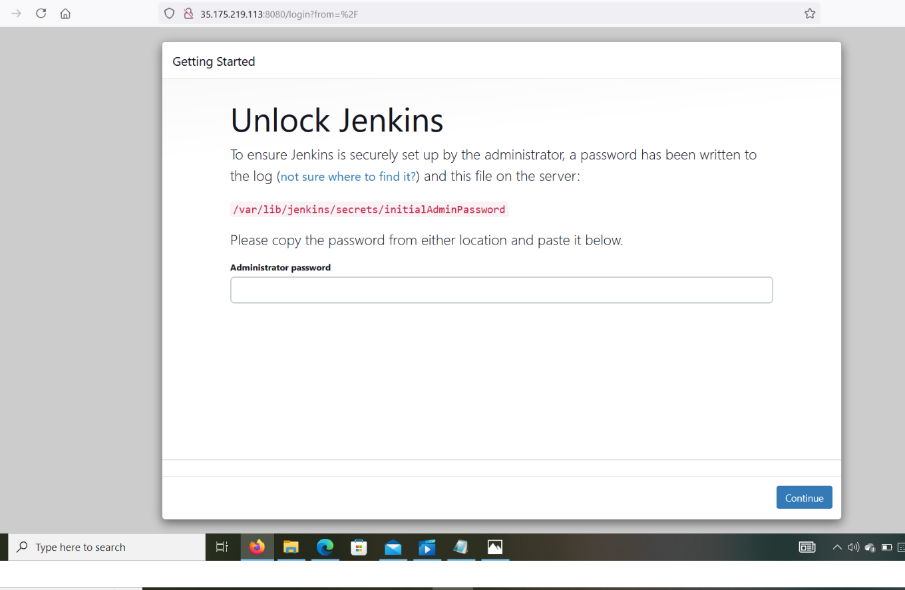
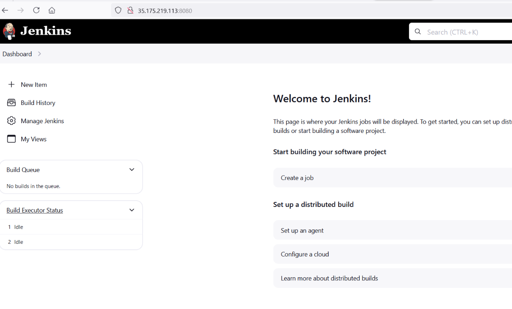

---

### Step 9: Install Ansible on Master

Install Ansible for configuration management:

```bash
sudo apt update
sudo apt install software-properties-common -y
sudo add-apt-repository --yes --update ppa:ansible/ansible
sudo apt install ansible -y
```

**Image Reference:**
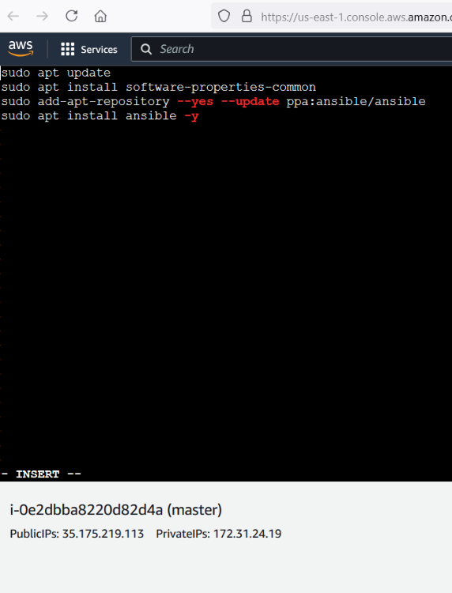

---

### Step 10: Verify Ansible Installation

Check the installed version:

```bash
ansible --version
```

**Expected Output:**
```
ansible [core 2.16.3]
config file = None
configured module search path = ['/root/.ansible/plugins/modules', '/usr/share/ansible/plugins/modules', '/usr/share/ansible/collections']
ansible python module location = /usr/lib/python3/dist-packages/ansible
python version = 3.12.3
```

**Image Reference:**
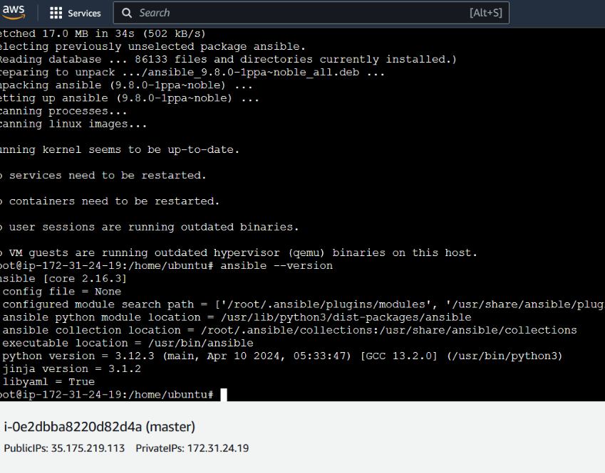

---

### Step 11: Install Ansible Plugin in Jenkins

Navigate to **Jenkins Dashboard > Manage Jenkins > Manage Plugins**

Search for "Ansible" and install the **Ansible plugin** (version 403.v8d0ca_dcb_b_502 or latest).

**Image Reference:**
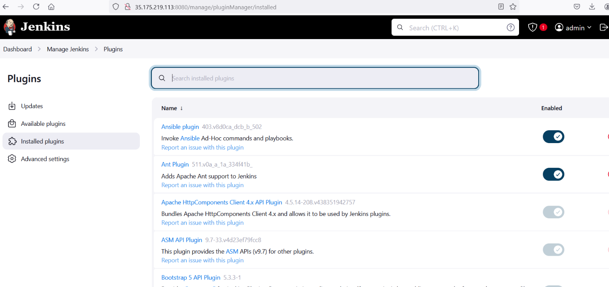

---

### Step 12: Add Ansible Tool Installer to Jenkins

Go to **Manage Jenkins > Tools** and configure Ansible:

1. Scroll to "Ansible installations"
2. Click "Add Ansible"
3. Set **Name:** `ansible`
4. Check **Install automatically**
5. Click **Add Installer** and select default installation
6. Save and apply changes
7. Restart Jenkins:

```bash
sudo systemctl restart jenkins
```

**Image Reference:**
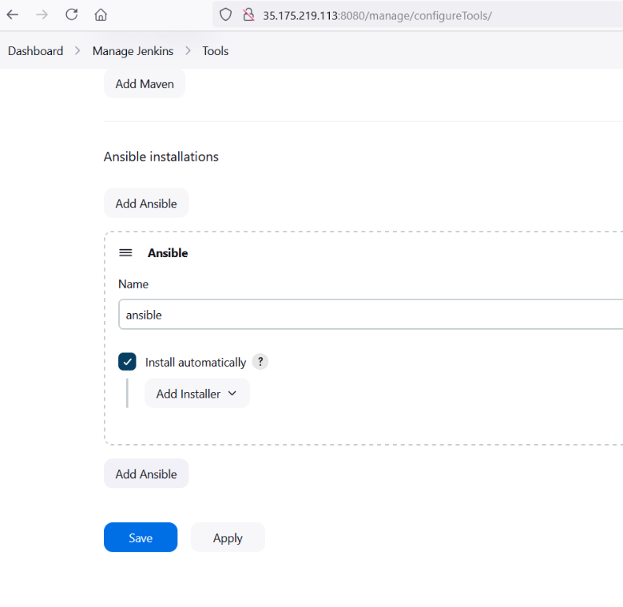

---

### Step 13: Configure Docker Hub Credentials in Jenkins Pipeline

In Jenkins, go to **Manage Jenkins > Credentials > System > Global credentials**

Create a new credential:
- **Kind:** Secret text
- **Secret:** Your Docker Hub password/token
- **ID:** `dockerhubpassword`
- **Description:** Docker Hub login credentials

**Image Reference:**
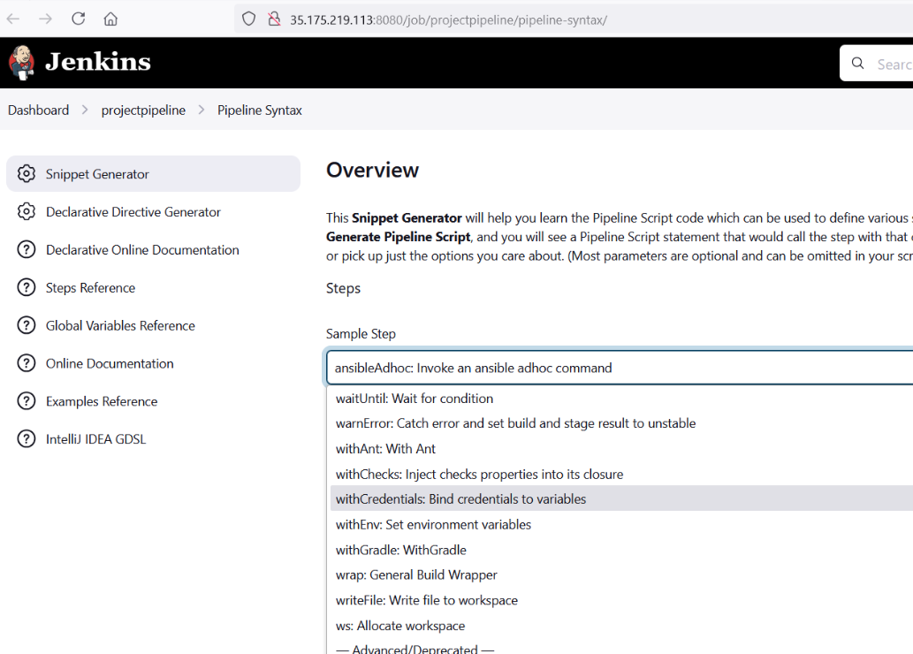

---

### Step 14-15: Build and Push Docker Image

Create a new Pipeline job in Jenkins with the following script:

**Pipeline Script:**

```groovy
pipeline {
    agent any
    
    environment {
        DOCKERHUB_CREDENTIALS = credentials('dockerhubpassword')
    }
    
    stages {
        stage('Checkout') {
            steps {
                git url: 'https://github.com/hll0raj/Banking-java-project.git'
                echo 'Git checkout completed'
            }
        }
        
        stage('Maven Test') {
            steps {
                sh 'mvn test'
            }
        }
        
        stage('Maven Checkstyle') {
            steps {
                sh 'mvn checkstyle:checkstyle'
            }
        }
        
        stage('Maven Compile') {
            steps {
                sh 'mvn compile'
            }
        }
        
        stage('Maven Package') {
            steps {
                sh 'mvn package'
            }
        }
        
        stage('Build Docker Image') {
            steps {
                sh 'docker build -t rajni644/project:1.0 .'
            }
        }
        
        stage('Login to Docker Hub') {
            steps {
                withCredentials([string(credentialsId: 'dockerhubpassword', variable: 'dockerhubpass')]) {
                    sh 'docker login -u rajni644 -p ${dockerhubpass}'
                }
            }
        }
        
        stage('Push to Docker Hub') {
            steps {
                sh 'docker push rajni644/project:1.0'
            }
        }
    }
}
```

Click **Build Now** to execute the pipeline.

**Image Reference:**
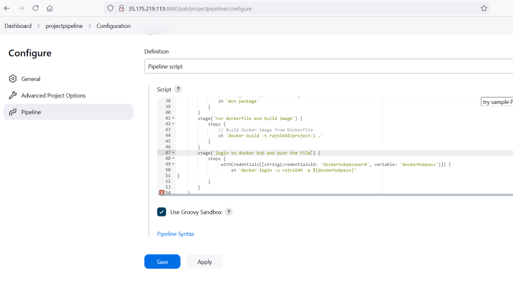
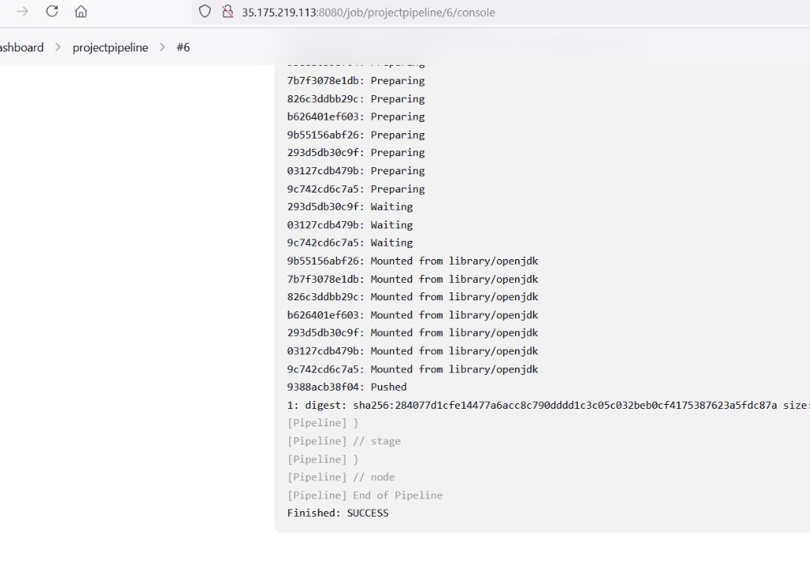

---

### Step 16: Copy Host Instance IP

From the AWS Console, copy the public IP of the Host instance:

- **Host Instance ID:** i-03700b7e5787
- **Public IP:** 54.160.143.217

**Image Reference:**
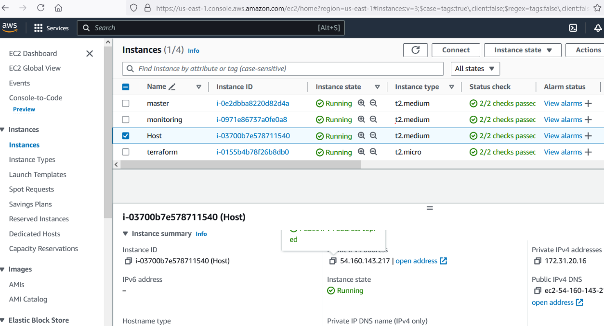

---

### Step 17: Configure Ansible Inventory

On the master instance, edit the Ansible hosts file:

```bash
vi /etc/ansible/hosts
```

Add the following configuration at the end of the file:

```
[demo-project]
54.160.143.217
```

**Image Reference:**
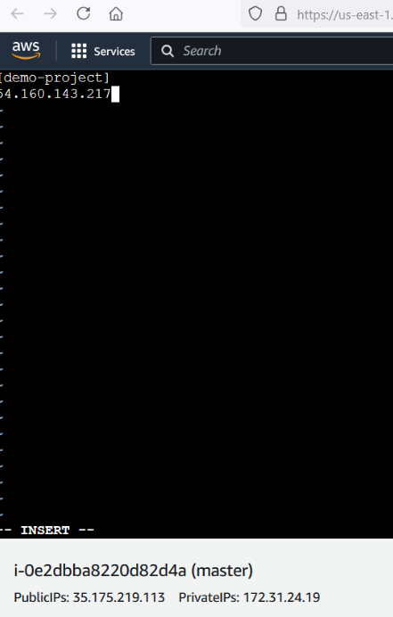

---

### Step 18: Configure Ansible with Jenkins

Go to **Jenkins > Pipeline Syntax > Snippet Generator**

Select **ansiblePlaybook: Invoke an ansible playbook** from the steps dropdown.

Configure the following parameters:
- **Playbook:** ansible-playbook.yml
- **Inventory:** /etc/ansible/hosts
- **Become:** true
- **Disable host key checking:** true
- **Credentials ID:** ansible

**Image Reference:**
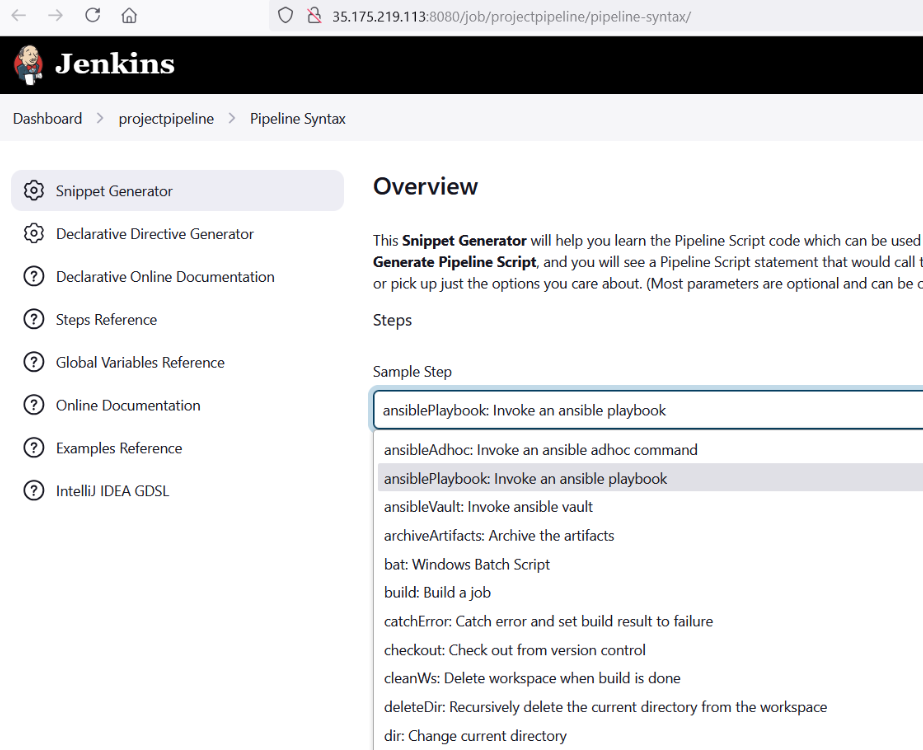

---

### Step 19: Create SSH Credentials for Ansible

Navigate to **Manage Jenkins > Credentials > System > Global credentials**

Create a new credential:
- **Kind:** SSH Username with private key
- **ID:** `ansible`
- **Description:** Ansible SSH key for host access
- **Username:** ubuntu
- **Private Key:** [Paste your EC2 private key]

**Image Reference:**


---

### Step 20: Add Private Key for Host Access

Ensure the private key file is uploaded with:
- **Treat username as secret:** Unchecked
- **Passphrase:** [Leave empty if no passphrase]

**Image Reference:**
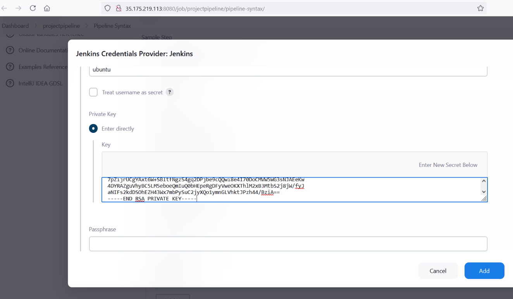

---

### Step 21: Generate and Add Pipeline Script

From the Snippet Generator output, copy the generated script:

```groovy
ansiblePlaybook(
    become: true,
    credentialsId: 'ansible',
    disableHostKeyChecking: true,
    installation: 'ansible',
    inventory: '/etc/ansible/hosts',
    playbook: 'ansible-playbook.yml',
    sudoUser: null,
    vaultTmpPath: ""
)
```

Add this to your Jenkinsfile in the deployment stage.

**Image Reference:**
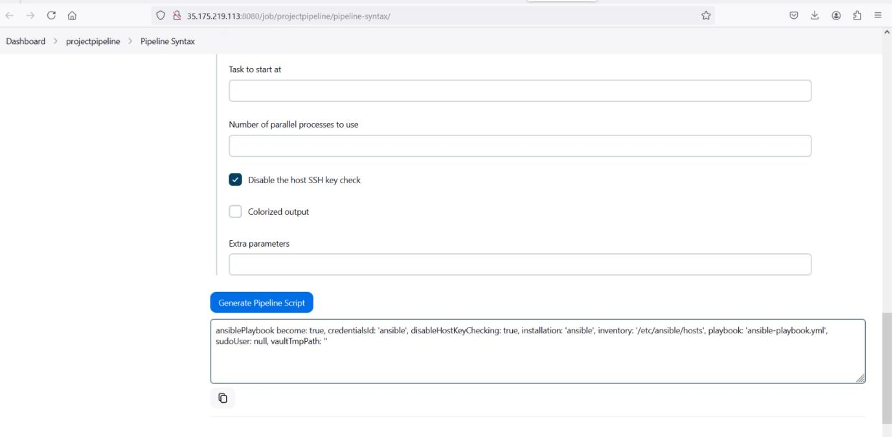

---

### Step 22: Create Dockerfile

Create a `Dockerfile` in your repository:

```dockerfile
FROM openjdk:11-jre-slim
WORKDIR /app
COPY target/*.jar app.jar
EXPOSE 8064
CMD ["java", "-jar", "app.jar"]
```

**Image Reference:**
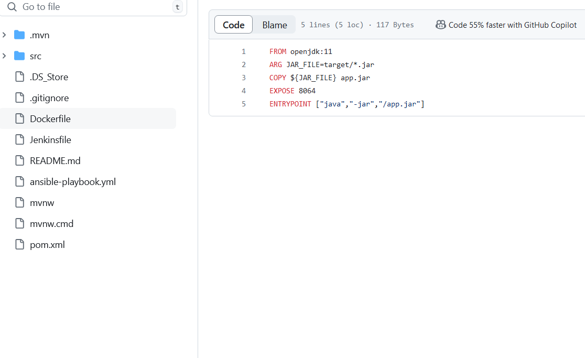

---

### Step 23: Create Ansible Playbook

Create `ansible-playbook.yml` for containerized deployment:

```yaml
---
- hosts: demo-project
  become: true
  tasks:
    - name: Update apt packages
      apt:
        update_cache: yes

    - name: Install Docker
      apt:
        name: docker.io
        state: present

    - name: Start Docker service
      systemd:
        name: docker
        state: started
        enabled: yes

    - name: Deploy Docker container
      docker_container:
        name: banking-app
        image: rajni644/project:1.0
        state: started
        ports:
          - "8088:8064"
        restart_policy: always
```

**Image Reference:**
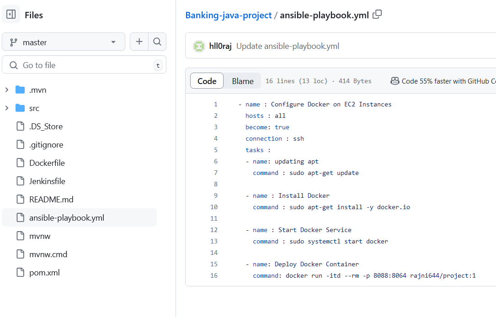

---

### Step 24: Complete Jenkinsfile

Create a complete `Jenkinsfile` with all stages:

```groovy
pipeline {
    agent any
    
    environment {
        DOCKERHUB_CREDENTIALS = credentials('dockerhubpassword')
    }
    
    stages {
        stage('Checkout') {
            steps {
                git url: 'https://github.com/hll0raj/Banking-java-project.git'
                echo 'Git checkout completed'
            }
        }
        
        stage('Maven Test') {
            steps {
                sh 'mvn test'
            }
        }
        
        stage('Maven Checkstyle') {
            steps {
                sh 'mvn checkstyle:checkstyle'
            }
        }
        
        stage('Maven Compile') {
            steps {
                sh 'mvn compile'
            }
        }
        
        stage('Maven Package') {
            steps {
                sh 'mvn package'
            }
        }
        
        stage('Build Docker Image') {
            steps {
                sh 'docker build -t rajni644/project:1.0 .'
            }
        }
        
        stage('Login to Docker Hub') {
            steps {
                withCredentials([string(credentialsId: 'dockerhubpassword', variable: 'dockerhubpass')]) {
                    sh 'docker login -u rajni644 -p ${dockerhubpass}'
                }
            }
        }
        
        stage('Push to Docker Hub') {
            steps {
                sh 'docker push rajni644/project:1.0'
            }
        }
        
        stage('Deploy with Ansible') {
            steps {
                ansiblePlaybook(
                    become: true,
                    credentialsId: 'ansible',
                    disableHostKeyChecking: true,
                    installation: 'ansible',
                    inventory: '/etc/ansible/hosts',
                    playbook: 'ansible-playbook.yml',
                    sudoUser: null
                )
            }
        }
    }
}
```

**Image Reference:**
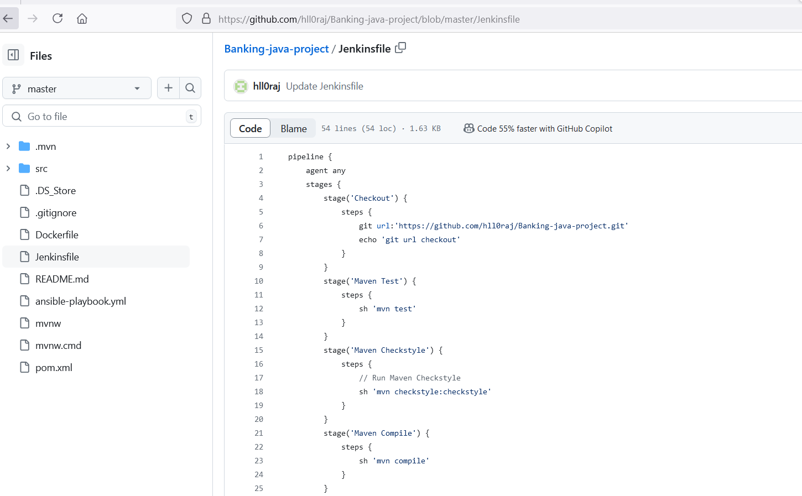
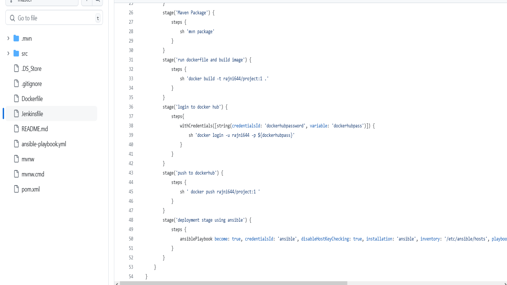

---

### Step 25-26: Execute Pipeline

Click on **Build Now** in Jenkins to trigger the pipeline execution. Monitor the build progress in the console output.

**Image Reference:**
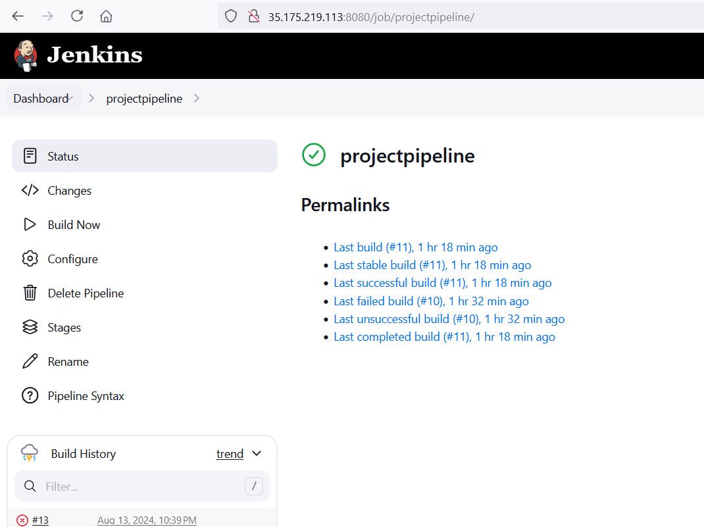

---

### Step 27: Verify Successful Build

Once the pipeline completes, verify the build status shows **SUCCESS**.

**Console Output Extract:**
```
[Pipeline] // stage
[Pipeline] }
[Pipeline] // node
[Pipeline] End of Pipeline
Finished: SUCCESS
```

**Image Reference:**
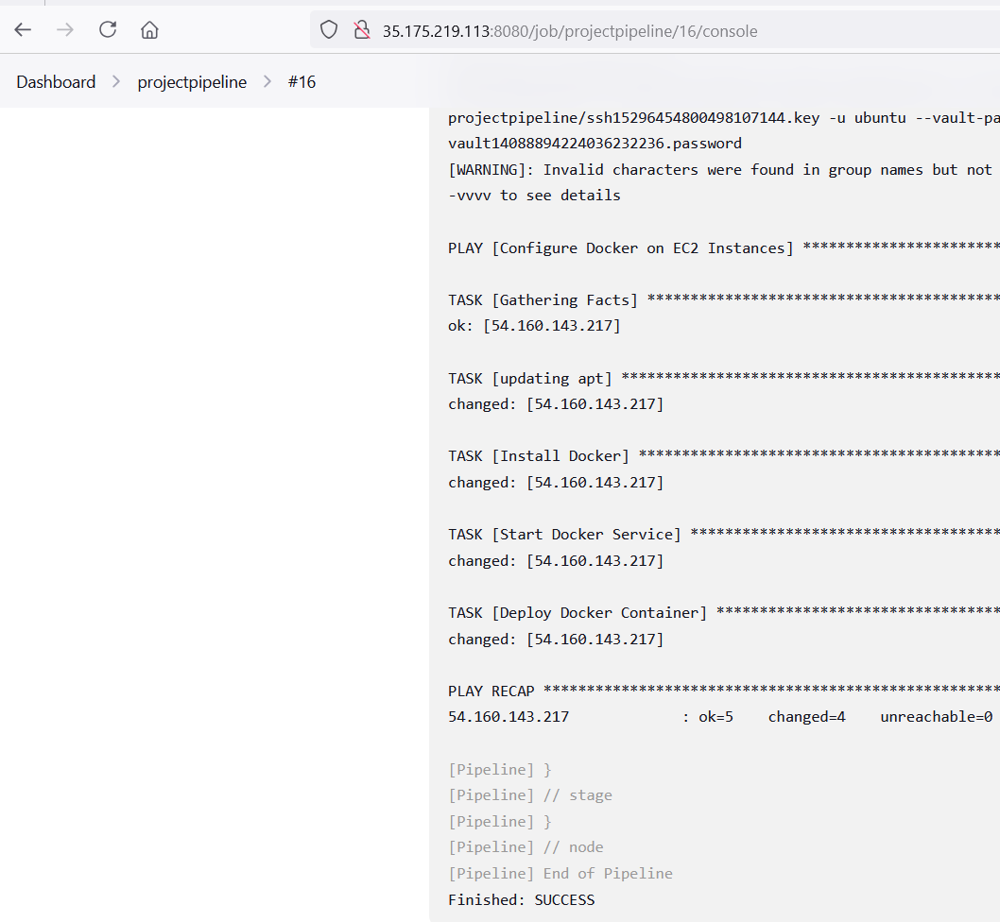

---

### Step 28: Verify Website Deployment

Access the deployed application:

```
http://54.160.143.217:8088
```

The Banking Services website should be running and accessible.

**Verify Container Status on Host:**

```bash
docker ps
```

**Expected Output:**
```
CONTAINER ID   IMAGE                   COMMAND                CREATED         STATUS         PORTS
a434f0590594   rajni644/project:1.0   "java -jar app.jar"   6 minutes ago   Up 6 minutes   0.0.0.0:8088->8064/tcp
```

**Image Reference:**

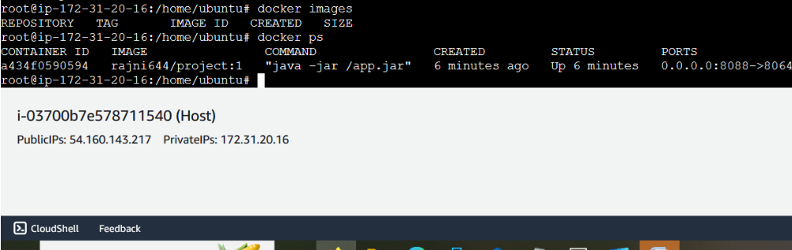

---

### Step 29: Install Node Exporter on Master

SSH into the master instance and download Node Exporter:

```bash
cd /home/ubuntu
wget https://github.com/prometheus/node_exporter/releases/download/v1.8.2/node_exporter-1.8.2.linux-amd64.tar.gz
tar -xvzf node_exporter-1.8.2.linux-amd64.tar.gz
cd node_exporter-1.8.2.linux-amd64
./node_exporter &
```

Verify Node Exporter is running:

```
ts=2024-08-13T23:07:57.915Z caller=tls_config.go:313 level=info msg="Listening on" address=[::]:9100
ts=2024-08-13T23:07:57.915Z caller=tls_config.go:316 level=info msg="TLS is disabled." http2=false
```

**Image Reference:**
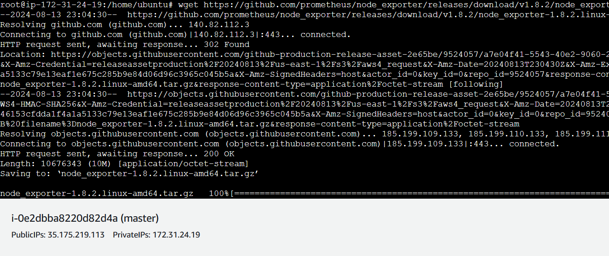

---

### Step 30: Install Node Exporter on Host

SSH into the host instance and install Node Exporter:

```bash
cd /home/ubuntu
wget https://github.com/prometheus/node_exporter/releases/download/v1.8.2/node_exporter-1.8.2.linux-amd64.tar.gz
tar -xvzf node_exporter-1.8.2.linux-amd64.tar.gz
cd node_exporter-1.8.2.linux-amd64
./node_exporter &
```

Verify the exporter is accessible:

```
http://54.160.143.217:9100/metrics
```

**Image Reference:**
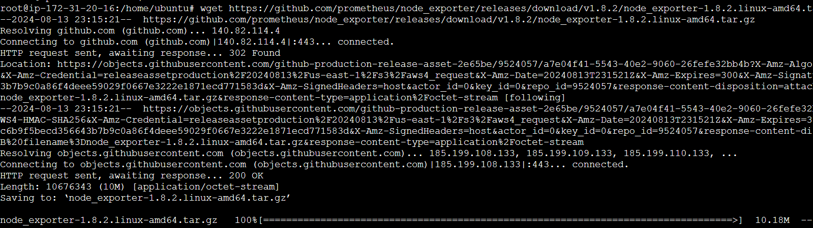
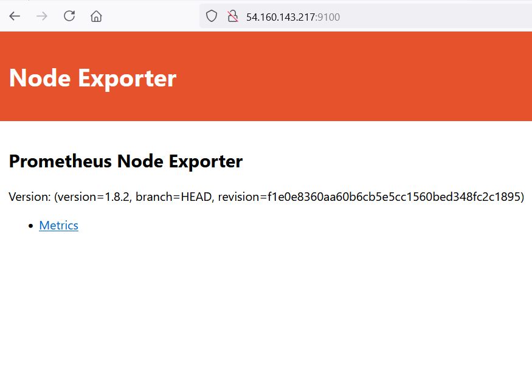

---

### Step 31: Install Prometheus on Monitoring EC2

SSH into the monitoring instance:

```bash
cd /home/ubuntu
wget https://github.com/prometheus/prometheus/releases/download/v2.53.2/prometheus-2.53.2.linux-amd64.tar.gz
tar -xvzf prometheus-2.53.2.linux-amd64.tar.gz
cd prometheus-2.53.2.linux-amd64
```

**Image Reference:**
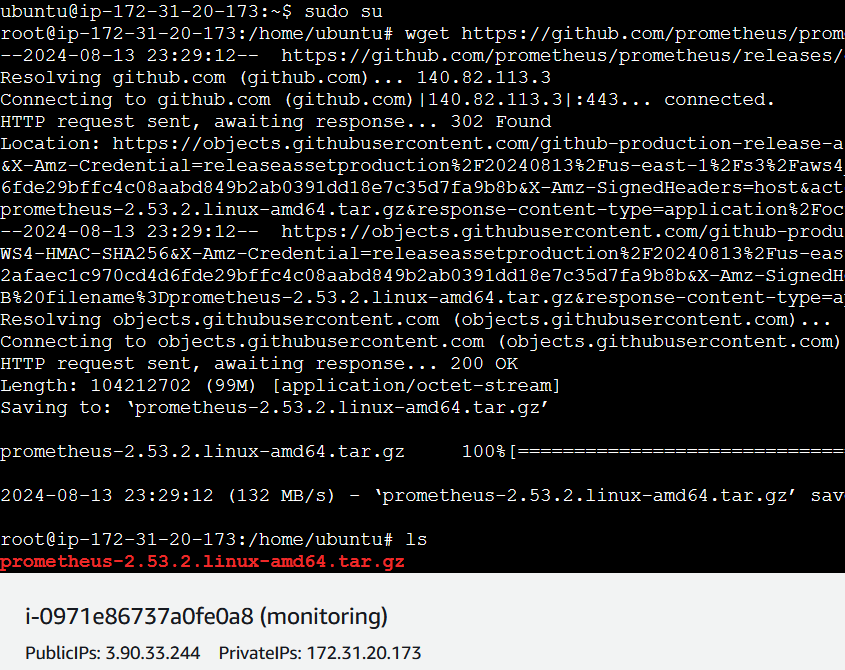

---

### Step 32: Extract and Start Prometheus

```bash
cd prometheus-2.53.2.linux-amd64
./prometheus &
```

Verify Prometheus is running:

```
http://3.90.33.244:9090
```

**Console Output:**
```
ts=2024-08-13T23:30:14.128Z caller=main.go:589 level=info msg="No time travel detected"
ts=2024-08-13T23:30:14.128Z caller=main.go:633 level=info msg="Server is ready"
```

**Image Reference:**
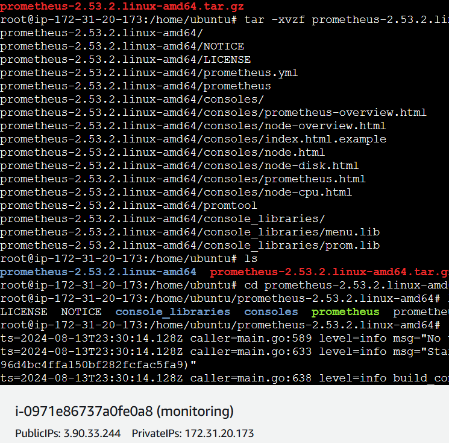

---

### Step 33: Configure Prometheus Targets

Edit the Prometheus configuration file:

```bash
vi prometheus.yml
```

Add the following scrape configurations:

```yaml
scrape_configs:
  - job_name: "prometheus"
    static_configs:
      - targets: ["localhost:9090"]

  - job_name: "Node-Exporter"
    static_configs:
      - targets: ["54.160.143.217:9100"]

  - job_name: "Node-Exporter2"
    static_configs:
      - targets: ["35.175.219.113:9100"]
```

Restart Prometheus for the changes to take effect.

**Verify Targets in Prometheus UI:**

Navigate to **Status > Targets** in the Prometheus web interface to confirm all targets are UP.

**Image Reference:**
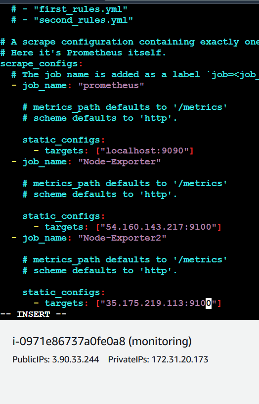
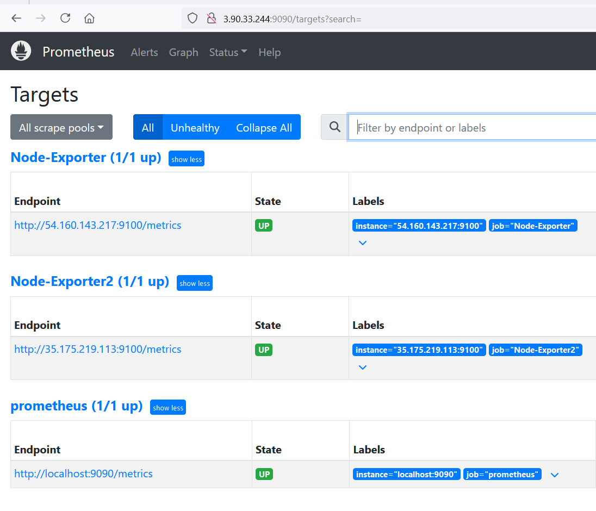

---

### Step 34: Install Grafana on Monitoring Server

Install Grafana repository and packages:

```bash
sudo apt-get install -y apt-transport-https software-properties-common wget
sudo mkdir -p /etc/apt/keyrings/
wget -q -O - https://apt.grafana.com/gpg.key | gpg --dearmor | sudo tee /etc/apt/keyrings/grafana.gpg > /dev/null
echo "deb [signed-by=/etc/apt/keyrings/grafana.gpg] https://apt.grafana.com stable main" | sudo tee -a /etc/apt/sources.list.d/grafana.list
sudo apt-get update
sudo apt-get install grafana-enterprise -y
sudo systemctl enable grafana-server
sudo systemctl start grafana-server
```

Access Grafana:

```
http://3.90.33.244:3000
```

Default credentials:
- **Username:** admin
- **Password:** admin

**Image Reference:**
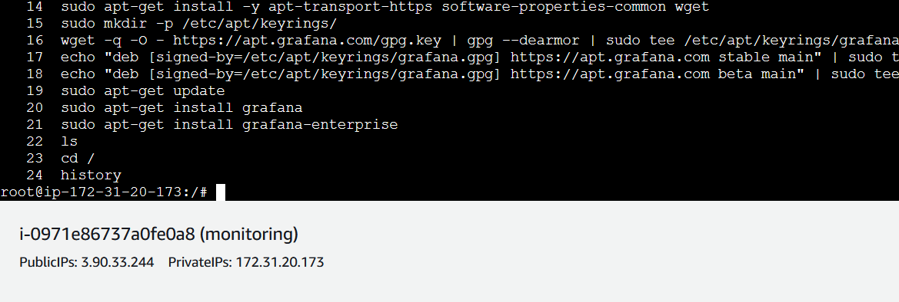
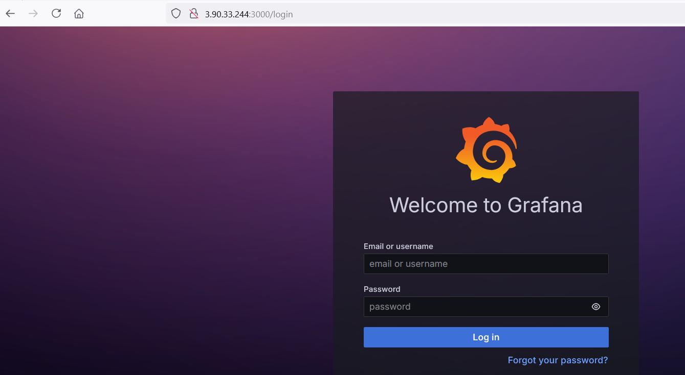

---

### Step 35: Add Prometheus Data Source

In Grafana Dashboard:

1. Navigate to **Home > Connections > Data Sources**
2. Click **+ Add new connection**
3. Search for and select **Prometheus**
4. Configure:
   - **Prometheus server URL:** `http://localhost:9090`
   - **Access:** Server (default)
5. Click **Save & test**

Verify the connection shows "Successfully queried the Prometheus API."

**Image Reference:**
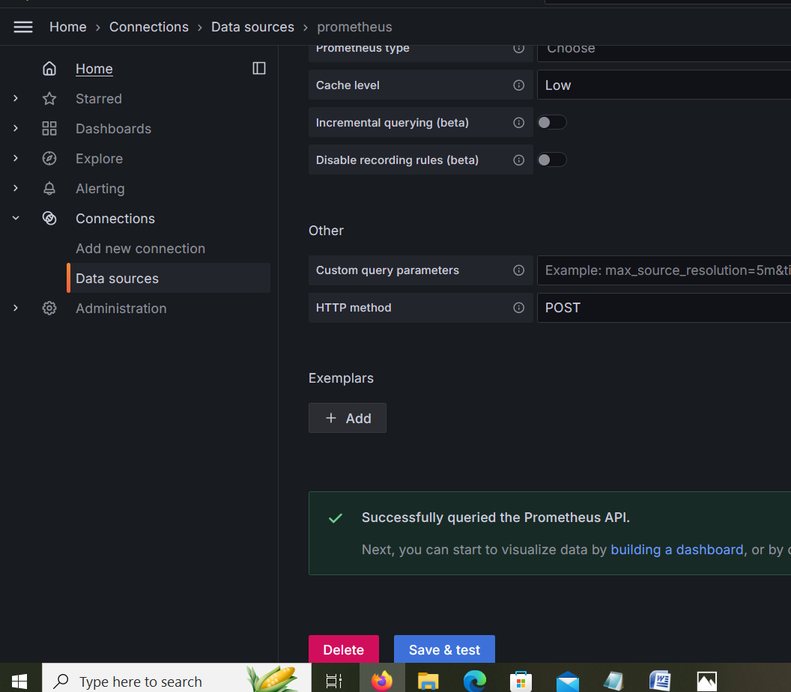

---

### Step 36: Create Monitoring Dashboards

Create dashboards to visualize metrics:

#### Dashboard 1: CPU Utilization

Query: `process_cpu_seconds_total`

#### Dashboard 2: Disk Space

Query: `node_filesystem_avail_bytes`

#### Dashboard 3: Free Available Memory

Query: `node_memory_MemAvailable_bytes`

1. Click **+ Create Dashboard**
2. Add new panel
3. Select metric from Prometheus
4. Customize visualization and save

**Image Reference:**
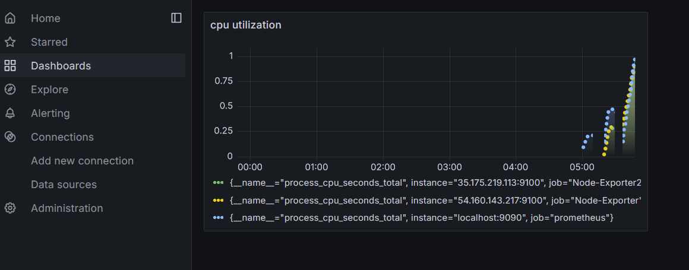

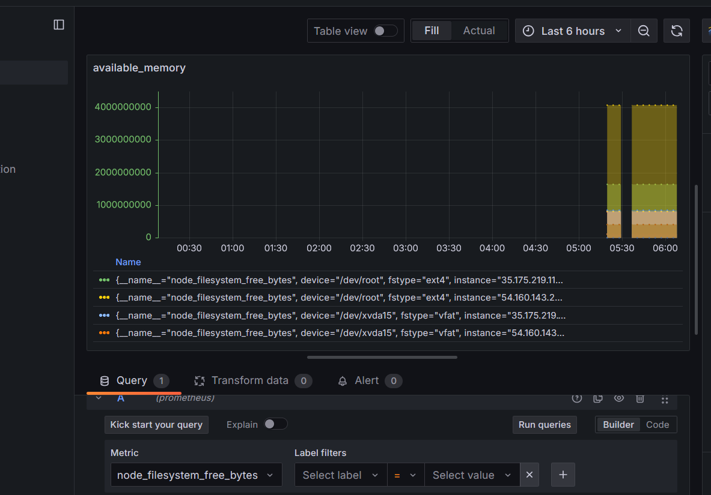

---

## Repository Structure

```
Banking-java-project/
├── .mvn/
├── src/
├── target/
├── .gitignore
├── .DS_Store
├── Dockerfile
├── Jenkinsfile
├── ansible-playbook.yml
├── mvnw
├── mvnw.cmd
├── pom.xml
└── README.md
```

---

## Key Services and Ports

| Service | Instance | Public IP | Port | Purpose |
|---------|----------|-----------|------|---------|
| Jenkins | Master | 35.175.219.113 | 8080 | CI/CD Pipeline Automation |
| Application | Host | 54.160.143.217 | 8088 | Deployed Banking Services |
| Node Exporter | Master | 35.175.219.113 | 9100 | Metrics Collection |
| Node Exporter | Host | 54.160.143.217 | 9100 | Metrics Collection |
| Prometheus | Monitoring | 3.90.33.244 | 9090 | Time-Series Database |
| Grafana | Monitoring | 3.90.33.244 | 3000 | Metrics Visualization |

---

## Troubleshooting

### Jenkins Not Starting

```bash
sudo systemctl status jenkins
sudo journalctl -u jenkins -n 50
```

### Docker Connection Issues

```bash
sudo usermod -aG docker jenkins
sudo systemctl restart jenkins
```

### Ansible Inventory Not Found

Verify hosts file path:
```bash
cat /etc/ansible/hosts
```

### Prometheus Targets Down

Check Node Exporter is running:
```bash
curl http://target-ip:9100/metrics
```

### Grafana Data Source Connection Failed

Ensure Prometheus URL is accessible from Grafana instance:
```bash
curl http://localhost:9090
```

---

## Next Steps

1. Set up alert rules in Prometheus for critical metrics
2. Configure Grafana alerting to notify via email or Slack
3. Implement Infrastructure as Code for Ansible playbooks
4. Add authentication and security groups to AWS resources
5. Set up automated backups for persistent data

---

## Resources

- [Terraform Documentation](https://www.terraform.io/docs)
- [Jenkins Pipeline Documentation](https://www.jenkins.io/doc/book/pipeline/)
- [Docker Official Documentation](https://docs.docker.com/)
- [Ansible Documentation](https://docs.ansible.com/)
- [Prometheus Documentation](https://prometheus.io/docs/)
- [Grafana Documentation](https://grafana.com/docs/grafana/latest/)

---

**Last Updated:** August 13, 2024  
**Version:** 1.0
